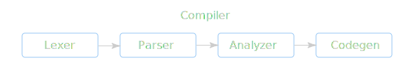

# Теория компиляции

<dfn>Компилятор</dfn> — это программа, которая преобразует один формальный язык
в другой формальный язык. Пример: `C++` → `Assembly`, `Markdown` → `HTML`.

Процесс компиляции обычно состоит из следующих стадий:

1. [лексический анализ](lexer/index.mdx)
2. [синтаксический анализ](parser/index.md)
3. создание промежуточного представления и его обработка
4. генерация кода на целевом языке
