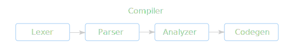

# Теория компиляции

<dfn>Компилятор</dfn> — программа, которая преобразует один формальный язык
в другой формальный язык. Пример: `C++` → `machine code`, `Markdown` → `HTML`.

Процесс компиляции обычно состоит из следующих стадий:

1. Препроцессинг — предварительная обработка исходного текста,
   например, удаление комментариев или подстановка строк.
2. [Лексический анализ](lexer/index.mdx) — преобразование входного текста
   в последовательность токенов.
3. [Синтаксический анализ](parser/index.md) — построение синтаксического
   дерева (AST).
4. Анализ — различные преобразования, например, оптимизации.
5. Сборка (генерация) — генерация текста на целевом языке.

Lexer  = лексический анализатор 
Parser = синтаксический анализатор

Tokenizing = лексический анализ 
Parsing    = синтаксический анализ
