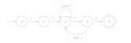

import { CodeBlock } from '@site/src/components/code-block';

# Лексический анализ

<dfn>Токен</dfn> (лексема, token) — это последовательность символов и её тип.

<dfn>Лексический анализ</dfn> — это процесс разбора входной последовательности
символов на распознанные группы с целью получения на выходе идентифицированных
последовательностей.

Программа, выполняющая лексический анализ называется *лексический анализатор*.

Пример разбора строки на лексемы:

<CodeBlock theme={'idea'} ligatures={false} tokens={[
  {"type": "string.js", "value": "\"2 + 33\""},
  {"type": "", "value": " => ["},
  {"type": "string.js", "value": "\"2\""},
  {"type": "", "value": ", "},
  {"type": "string.js", "value": "\" \""},
  {"type": "", "value": ", "},
  {"type": "string.js", "value": "\"+\""},
  {"type": "", "value": ", "},
  {"type": "string.js", "value": "\" \""},
  {"type": "", "value": ", "},
  {"type": "string.js", "value": "\"33\""},
  {"type": "", "value": "]"}
]}/>

Лексер как правило работает в одном из двух режимов:
1. выдача очередного токена парсеру
2. проход с составлением списка токенов

--- --- ---

<dfn>НКА</dfn> — недетерминированный конечный автомат 
<dfn>ДКА</dfn> — детерминированный конечный автомат

Способы создания лексического анализатора на основе регулярных выражений:
+ конвертировать регулярное выражение в НКА, моделировать НКА
+ конвертировать регулярное выражение в НКА, затем НКА в ДКА
+ [конвертировать регулярное выражение напрямую в ДКА](regex-to-dfa.mdx)

Каждый из вариантов может быть применим в зависимости от требований к скорости
работы или затрат по памяти. Для реальных примеров ДКА как правило получается
очень большой, но моделирование НКА работает значительно медленнее.

#### Пример ДКА на основе регулярного выражения: {#regex-dfa-example}

<CodeBlock theme={'idea'} tokens={[
  {"type": "", "value": "BlockComment\n  : "},
  {"type": "string.js", "value": "'/*'"},
  {"type": "", "value": " ."},
  {"type": "string.regex.quantifier.js", "value": "*?"},
  {"type": "", "value": " "},
  {"type": "string.js", "value": "'*/'"},
  {"type": "", "value": "\n  ;"},
]}/>

### Процесс токенизации {#tokenization}

Для интерпретации, помимо таблицы переходов ДКА и начального состояния,
необходима дополнительная информация про каждое принимающее состояние.
Каждое принимающее состояние должно соответствовать какому-либо типу токена.
При конфликте как правило приоритет отдаётся правилу, которое в исходной
грамматике было объявлено первым.

Лексический анализатор всегда пытается выделить лексему наибольшей длины.
При интерпретации история состояний хранится в стеке. ДКА выполняется, пока он
не перейдёт в состояние ошибки. После этого стек отматывается до тех пор,
пока не встретится принимающее состояние. Длина лексемы будет равна текущему
размеру стека.
