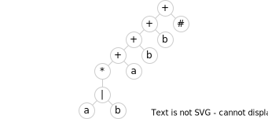

# Дерево регулярного выражения



## Работа с Unicode

Unicode 15 версии включает в себя приблизительно 150 тысяч символов.
Учитывая, что таблица переходов конечного автомата должна содержать по столбцу
на каждый символ алфавита, это очень накладно.

Кроме этого, символы занимают кодовое пространство неравномерно, существуют
незаполненные интервалы что не позволяет использовать код символа напрямую как
индекс в представлении таблицы.

Решением может быть чтение входной строки **в бинарном виде**. В этом случае
алфавит автомата станет равен 256 символам: числа от 0 до 255. Лексический
анализатор будет принимать на вход последовательность байт, а после
распознавания токена лексема может быть преобразована в строку.

Проблемой в данном случае станет работа с исходной грамматикой: каждый
отдельный символ необходимо перевести в последовательность байт, что
в большинстве случаев увеличит размер дерева.

### Последовательность символов

Последовательность символов (`'#'`, `'текст'` и т.п.) преобразуется
в соответствующую ей последовательность байт, образуя цепочку узлов
конкатенации.

### Классы символов и отрицания

_Классы (промежутки)_ символов являются расширением для канонической модели
регулярного выражения и должны быть преобразованы в конкретное множество
допустимых символов. _Отрицание_ также является расширением и преобразуется во
множество допустимых символов.

Преобразование класса символов напрямую в один огромный "или" значительно
увеличит размер дерева. Особой проблемой при работе с Юникодом является
отрицание. Конкатенация `n` символов или альтернатива на `n` вариантов дают
`2n - 1` узлов.

#### Для решения проблемы используется следующий алгоритм:

Алгоритм рассчитан на работу с кодировкой UTF-8.

На первом этапе промежуток определяется двумя кодовыми точками символов.
Например, для `'a'..'z'` получим `[0x61, 0x7A]`. Считается, что первая кодовая
точка (начало) больше либо равна второй (конец).

Определяется множество промежутков, задающих все допустимые символы.
Для каждой версии Юникода эти промежутки будут несколько различаться.

Отрицание преобразуется во множество промежутков, образованное от всех
допустимых символов, путём вычитания из него отрицаемым символов.

Каждый промежуток перед преобразованием в набор узлов дерева должен быть
дополнительно разбит таким образом, чтобы начало и конец каждой части
кодировались одинаковым количеством байт.

Пример: `[0x0, 0xFFFF] => [0x0, 0x7F], [0x80, 0x7FF], [0x800, 0xFFFF]`.

Далее в полученных промежутках кодовые точки заменяются последовательностью
байт. Для `[0x80, 0x7FF]` получим `[[0xC2, 0x80], [0xDF, 0xBF]]`.

| Байт | Паттерн                               |
|------|---------------------------------------|
| 1    | `0xxxxxxx`                            |
| 2    | `110xxxxx 10xxxxxx`                   |
| 3    | `1110xxxx 10xxxxxx 10xxxxxx`          |
| 4    | `11110xxx 10xxxxxx 10xxxxxx 10xxxxxx` |

В UTF-8 символ может быть закодирован последовательностью от 1 до 4 байт.
Таким образом имеем 4 возможных варианта, которые необходимо обработать:

1. `r1(s1, e1)`
2. `r2(s1, s2, e1, e2)`
3. `r3(s1, s2, s3, e1, e2, e3)`
4. `r4(s1, s2, s3, s4, e1, e2, e3, e4)`

Каждому варианту для конкретных значений соответствует какая-то структура узлов
дерева регулярного выражения.

Далее используются следующие обозначения:
+ `&` — узел конкатенации
+ `|` — узел "или"

**r1(s1, e1)**:

Если `s1 == e1`, это обычный символьный узел:
```
s1
```

Если `e1 - s1 == 1`, это узел "или":
```
s1 | e1
```

Во всех остальных случаях образуется цепочка узлов "или":
```
(((s1 | s1+1) | ...) | e1-1) | e1
```

**r2(s1, s2, e1, e2)**:

Если `s1 == e1`:

```
s1 & r1(s2, e2)
```

Если `e1 - s1 == 1`:

```
s1 & r1(s2, 192) |
e1 & r1(128, e2)
```

Во всех остальных случаях:

```
s1             & r1(s2, 192)  |
r1(s1+1, e1-1) & r1(128, 191) |
e1             & r1(128, e2)
```

**r3(s1, s2, s3, e1, e2, s3)**:

Если `s1 == e1`:
```
s1 & r2(s2, s3, e2, e3)
```

Во всех остальных случаях:
```
s1 & s2 & r1(s3, 191)                 |
r2(s1, s2+1, e1, e2-1) & r1(128, 191) |
e1 & e2 & r1(128, e3)
```

**r4(s1, s2, s3, s4, e1, e2, s3, s4)**:

Если `s1 == e1`:
```
s1 & r3(s2, s3, s4, e2, e3, e4)
```

Во всех остальных случаях:
```
s1 & s2 & s3 & r1(s4, 191)                    |
r3(s1, s2, s3+1, e1, e2, e3-1) & r1(128, 191) |
e1 & e2 & e3 & r1(128, e4)
```
