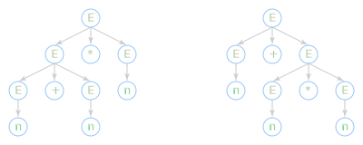

# Грамматика

В теории формальных языков язык рассматривается как набор *предложений*.
Предложение состоит из последовательности *слов*, которые являются
конкатенацией ряда символов из конечного *алфавита*.

Язык описывается наборов правил, которые описывают его структуру или
*синтаксис*. Эти правила, известные как *грамматика*, могут быть использованы
для создания или распознавания синтаксически правильных предложений.

## Классификация {#classification}

Наиболее известная классификация — иерархия Хомского. Грамматики делятся
на 4 типа по структурам, которые они способны определять.

+ Тип 0: неограниченная
+ Тип 1: контекстно-зависимая
+ Тип 2: контекстно-свободная
+ Тип 3: регулярная

Правила регулярной грамматики сильно ограничены и могут определять только
простые языки, но они играют важную роль в распознавании более сложных языков.

Правила контекстно-свободной грамматики менее ограничны. В частности они могут
определять рекурсивно-вложенные структуры, характерные для многих языков
программирования.

Контекстно-зависимые грамматики определяют языки, структура которых зависит от
окружающего контекста. Они имеют сложную структуру и, как и неограниченные
грамматики, обычно представляют лишь теоретический интерес.

## Контекстно-свободная грамматика {#context-free-grammar}

<dfn>Контекстно-свободная грамматика</dfn> (context-free grammar, CFG) — это
формальная грамматика, правила которой могут применяться к нетерминальному
символу независимо от его контекста. Язык, порождённый КС-грамматикой,
называется контекстно-свободным языком.

Пример: `a b();`. В языке C это объявление функции, а в языке C++ — объявление
функции или инициализация переменной *в зависимости от контекста*.

### Формальное определение {#formal-definition}

<dfn>Грамматикой</dfn> называется набор 4 объектов:
1. $$ T $$ — множество терминальных символов
2. $$ N $$ — множество нетерминальных символов ($$T$$ и $$N$$ не пересекаются)
3. $$ P $$ — множество правил вывода (production rules)
4. $$ S $$ — начальный символ грамматики (аксиома, start symbol)

<dfn>Терминальный символ</dfn> (terminal symbol) — это символ, непосредственно
присутствующий в языке и имеющий символьное значение.

<dfn>Нетерминальный символ</dfn> (non-terminal symbol) — это символ,
обозначающий какую-либо сущность языка, но не имеющий конкретного символьного
значения.

### Терминология и нотация {#terms}

При записи используются следующие соглашения:
+ маленькие буквы из начала английского алфавита, цифры и символы типа `+`,
  представляют терминалы: $$ a $$, $$ * $$;
+ большие буквы из начала алфавита представляют нетерминалы:
  $$ A $$, $$ S $$;
+ маленькие буквы из конца алфавита представляют строки терминалов:
  $$ x $$, $$ y $$;
+ большие буквы из конца алфавита представляют строки либо терминалов,
  либо нетерминалов: $$ X $$, $$ Y $$;
+ маленькие греческие буквы представляют строки терминалов и/или нетерминалов:
  $$ \beta $$, $$ \gamma $$.

Здесь, *строка* (string) — это любая конечная последовательность символов.

В каноничном виде, правило записывается в виде $$ A \to β $$, где
$$ A $$ — один нетерминальный символ, а $$ β $$ — строка терминалов
и/или нетерминалов.

Также распространены *форма Бэкуса — Наура* (Backus-Naur form, BNF) и её
расширенная версия (extended Backus-Naur form, EBNF).
См. [расширения грамматики](grammar-extensions.md).

#### Вывод {#derivation-terms}

Замена одного нетерминала в последовательности терминалов и нетерминалов
называется *шагом вывода* (derivation step) и обозначается символом $$ \rArr $$.
Применение нескольких шагов вывода называется *выводом* (derivation).

Для обозначения вывода, состоящего из нуля или более шагов используется символ
$$ \overset{*}{\rArr} $$, для вывода из одного или более шагов используется
$$ \overset{+}{\rArr} $$.

Поскольку на каждом шаге вывода приходится выбирать, какие нетерминалы
заменять, обычно используется один из двух подходов: всегда заменяется либо
самый левый (leftmost derivation), либо самый правый нетерминал
(rightmost derivation).

Любая строка $$ \alpha $$, такая, что $$ S \overset{*}{\rArr} \alpha $$,
называется *формой предложения* (sentential form), а форма предложения,
содержащая только терминалы, называется *предложением* (sentence).

#### Правила {#rule-terms}

Нетерминал, который выводит пустую строку, называется *нулевым* (nullable rule).
Для обозначения пустой строки используется символ $$ \epsilon $$.

Правило вида $$ A \to \alpha\beta $$, где
$$ \beta \overset{*}{\rArr} \epsilon $$, называется правым нулевым правилом
(right nullable rule).

Говорят, что грамматика, содержащая нетерминал $$ A $$, такой, что
$$ A \overset{+}{\rArr} \alpha A \beta $$, где<br/>
$$ \alpha, \beta \not = \epsilon $$, содержит саморазложение (self-embedding).

Грамматика имеет *левую (или правую) рекурсию*, если она содержит нетерминал
$$ A $$ с выводом $$ A \overset{+}{\rArr} \alpha A \beta $$, где
$$ \alpha \overset{*}{\rArr} \epsilon $$ (или
$$ \beta \overset{*}{\rArr} \epsilon$$). Если при этом
$$ \alpha \not = \epsilon $$ (или $$ \beta \not = \epsilon $$), то рекурсия
называется скрытой.

## Неоднозначности {#grammar-ambiguity}

<dfn>Неоднозначность</dfn> (ambiguity) — это ситуация, при которой некоторые
строки имеют более одного дерева разбора.

#### Пример: {#ambiguity-example}

```text
S ::= E
E ::= E + E | E * E | n
```

Ниже показаны два разных дерева разбора для ввода `n + n * n`:


