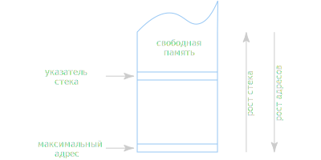

# Аппаратный стек

**Аппаратный стек** — это непрерывная область памяти для которой в специальном
регистре хранится адрес вершины стека; при этом память выше вершины считается
свободной, а память от вершины до конца области, включая саму вершину,
считается занятой.

Регистр, хранящий адрес вершины называется **указателем стека**.

Размер стека увеличивается в сторону уменьшения адресов.
Операция добавления в стек уменьшает адрес вершины.

Стек используется при вызовах подпрограмм для хранения адресов возврата,
для передачи параметров в подпрограммы и для хранения локальных переменных.

**Вызов подпрограммы** — это временная передача управления подпрограмме
с последующим возвратом управления в место, откуда её вызывали.

При вызове нужно запомнить адрес возврата, т.е. адрес команды, следующей
за командой вызова. При этом подпрограмма должна иметь возможность
воспользоваться этим адресом, чтобы вернуть управление.

Также при вызове подпрограммы в стеке необходимо зарезервировать место под
параметры, с которыми вызывается подпрограмма, и локальные переменные, которые
подпрограмма будет использовать для своей работы.

Область стековой памяти, содержащая связанные с одним вызовом значения
параметров, локальные переменные и адрес возврата называется
**стековым фреймом**.

Параметры в стеке размещает вызывающая программа, при вызове в стек заносится
адрес возврата и далее вызванная подпрограмма резервирует место в стеке под
локальные переменные. Всё это вместе образует стековый фрейм.

При этом как правило компиляторы языков, если это возможно, стараются
передавать параметры с помощью регистров.

## Организация стека на примере архитектуры x86-64

Для указателя стека используется регистр `rsp`.
При добавлении в стек значение `rsp` уменьшается, а при извлечении
из стека — увеличивается.

Добавление в стек производится командой `push`;
извлечение из стека производится командой `pop`.

Для вызова подпрограммы используется команда `call`.
Возврат из подпрограммы осуществляется с помощью команды `ret`.

Выполняя команду `ret` процессор извлекает из вершины стека адрес и записывает
его в регистр `rip`.

К содержимому стекового фрейма можно обратиться, используя смещение
относительно адреса в регистре указателя стека.

Например, если подпрограмма ожидает два параметра по 8 байт и использует
2 локальные переменные по 16 байт, тогда:

+ адрес возврата доступен по адресу `[rsp]`
+ параметры доступны по адресам `[rsp+8]` и `[rsp+16]`
+ локальные переменные доступны по адресам `[rsp-16]` и `[rsp-32]`

На практике подпрограмма первым делом сохраняет текущее значение регистра
`rsp` в регистр `rbp` и использует его как опорную точку. Это вызвано в первую
очередь тем, что подпрограмма зачастую сама вызывает подпрограммы. Вызываемая
подпрограмма обязана перед возвратом управления восстановить исходные значения
большинства регистров, в том числе `rbp`.
