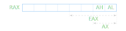

# Центральный процессор

**Центральный процессор** представляет из себя электронную схему, главное
и единственное предназначение которой — выполнять элементарные действия
из которых состоит программа.

Возможные действия определены фиксированным набором команд и задаются через
код, т.е. каждой команде соответствует какое-либо число.

## Устройство процессора

TODO.

Архитектуры процессоров:
+ `x86` и `x86-64`: наиболее популярны в классических компьютерах
+ `arm` и `arm64`: наиболее популярны в телефонах, планшетах и т.п.
+ `riscv32` и `riscv64`: популярны в бытовой электронике

## Архитектура x86-64

Процессор может работать в нескольких режимах с разными уровнями возможностей,
но на практике используются только два: самый привилегированный использует
операционная система, а в самом "простом" работают все остальные программы,
по необходимости делая системные вызовы.

### Система регистров

Все регистры можно условно разделить на регистры **общего назначения**,
**сегментные** и **специальные**.

Сегментные регистры технические и на практике программе не требуется их
изменять. Изменением значений этих регистров занимается операционная система.

#### Регистры общего назначения:

`RAX` – accumulator 
`RBX` – base 
`RCX` – counter 
`RDX` – data

`RSI` – source index 
`RDI` – destination index

`RBP` – base (frame) pointer 
`RSP` – stack pointer 

`R8 - R15` – регистры, добавленные именно в x86-64; все предыдущие
унаследованы от x86.

Ввиду обратной совместимости в каждом из вышеперечисленных регистров выделяются
части: младшие 32 бита, 16 бит, первый и второй байт.

Для младших 32 бит буква R заменяется на E, младшие 16 бит обозначаются
двумя буквами без R.

Названия регистров общего назначения

| 8 байт | Первые 4 | Первые 2 | Первый |
|--------|----------|----------|--------|
| rax    | eax      | ax       | al     |
| rbx    | ebx      | bx       | bl     |
| rcx    | ecx      | cx       | cl     |
| rdx    | edx      | dx       | dl     |
| rsi    | esi      | si       | sil    |
| rdi    | edi      | di       | dil    |
| rsp    | esp      | sp       | spl    |
| rbp    | ebp      | bp       | bpl    |
| r`i`   | r`i`d    | r`i`w    | r`i`b  |

`i` от 8 до 15.

#### Регистры специального назначения:

`RIP` (instruction pointer) — хранит адрес места в оперативной памяти, откуда
процессору нужно взять следующую инструкцию на выполнение.

`FLAGS` (flag register) — регистр, каждый бит которого используется как флаг;
некоторые флаги процессор выставляет сам в зависимости от результатов
выполнения какой-либо инструкции, а некоторые устанавливаются явно через
другие инструкции.

+ `ZF` (zero flag) — устанавливается после выполнения арифметических операций
  и операций сравнения

+ `CF` (carry flag) — флаг переноса; выставляется в единицу, если после
  арифметической операции над беззнаковыми числами результат не поместился
  в регистр, либо при вычитании вычитаемое оказалось больше уменьшаемое

+ `SF` (sign flag) — устанавливается равным старшему биту результата
  (для знаковых чисел соответствует знаку числа)

+ `OF` (overflow flag) — выставляется в единицу, если при работе со знаковыми
  числами произошло переполнение

Есть ещё много других флагов, но на практите они используются редко или их
изменение доступно только в привилегированном режиме.
