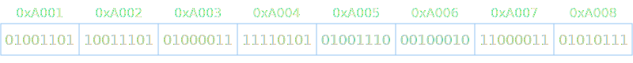
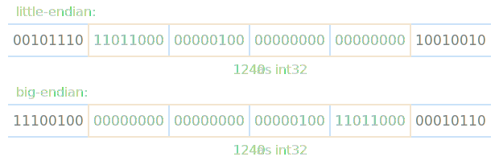
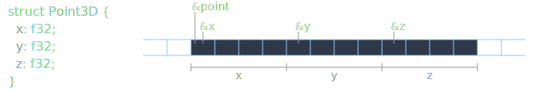

# Структуры данных

Компьютерная память состоит из ячеек одинакового размера. В современных
компьютерах каждая ячейка хранит 8 бит информации. Исторически, это количество
битов, используемых для кодирования одного символа текста (*байт*).

Для доступа к произвольному месту в памяти используется адресация. Каждая
ячейка имеет свой *адрес*. Адрес ячейки — это уникальный номер, с помощью
которого процессор может получить к этой ячейке.

Т.к. адреса могут быть достаточно большими, для записи обычно используется
шестнадцатеричная система счисления. Для записи значения ячейки обычно
используется двоичная или шестнадцатеричная система.

## Данные {#data}

В памяти приходится хранить вообще любую информацию, которую обрабатывает
компьютер: числа, символы и текст, программы и многое другое. Ячейка сама
по себе не знает, как следует понимать хранящуюся в ней информацию:
одни и те же байты можно интерпретировать разными способами.

Одна ячейка может иметь 28 = 256 различных значений. Когда диапазона
значений одной ячейки не хватает, используется несколько ячеек, идущих подряд.
Такой промежуток ячеек называется *областью памяти*.

## Представление числа в памяти {#number}

Int, uint, float, double...

### Целые числа {#int}

Компьютеры используют двоичную систему счисления. Для представления числа
выделяется фиксированное количество разрядов, обычно это 8, 16, 32 или 64 бита.
Эти размеры соответствуют размерам регистров общего назначения в процессоре.

Для целого числа без знака, если для хранения числа используется одна ячейка,
то значения битов будут соответствовать двоичной записи этого числа. Например,
числу 42 будет соответствовать значение `00101010`.

### Числа с плавающей точкой {#float}

## Структуры {#struct}

Выравнивание

## Массивы {#array}

! картинка для массива

## Символы и строки {#string}

Кодировки
