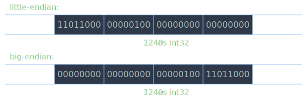

# Структуры данных

Компьютерная память состоит из ячеек одинакового размера. В современных
компьютерах каждая ячейка хранит 8 бит информации. Исторически, это количество
битов, используемых для кодирования одного символа текста (*байт*).

Для доступа к произвольному месту в памяти используется адресация. Каждая
ячейка имеет свой *адрес*. Адрес ячейки — это уникальный номер, с помощью
которого процессор может получить к этой ячейке.

Т.к. адреса могут быть достаточно большими, для записи обычно используется
шестнадцатеричная система счисления. Для записи значения ячейки обычно
используется двоичная или шестнадцатеричная система.

## Данные {#data}

В памяти приходится хранить вообще любую информацию, которую обрабатывает
компьютер: числа, символы и текст, программы и многое другое. Ячейка сама
по себе не знает, как следует понимать хранящуюся в ней информацию:
одни и те же байты можно интерпретировать разными способами.

Одна ячейка может иметь 28 = 256 различных значений. Когда диапазона
значений одной ячейки не хватает, используется несколько ячеек, идущих подряд.
Такой промежуток ячеек называется *областью памяти*.

## Число {#number}

Число с точки зрения математики и информатики — это разные вещи, в математике
числа неограничены. Например, для любого натурального числа $$ n $$ существует
число $$ n + 1 $$.

Из-за того, что для представления числа в памяти отведён конечный размер,
возникает понятие наименьшего и наибольшего числа. Для дробных чисел возникает
предел точности. Например, невозможно сохранить в памяти иррациональное число.

На текущий момент устаялась система из нескольких численных типов данных,
каждый из которых подходит под определённые задачи. Сюда входит множество
целочисленных типов разного размера, знаковые и беззнаковые, а также числа
с плавающей точкой (floating point), которые могут хранить нецелые числа.

### Целые числа {#int}

Компьютеры используют двоичную систему счисления. Для представления числа
выделяется фиксированное количество разрядов, обычно это 8, 16, 32 или 64 бита.
Эти размеры соответствуют размерам регистров общего назначения в процессоре.

Для целого числа без знака, если для хранения числа используется одна ячейка,
то значения битов будут соответствовать двоичной записи этого числа. Например,
числу 42 будет соответствовать значение `00101010`.

Если для хранения числа используется несколько ячеек, появляется понятие
*порядка байт* (endianness). Порядок может быть прямой (big-endian) и обратный
(little-endian). Если используется прямой порядок байт, то представление
числа в памяти соответствует его двоичной записи. При обратном порядке
байты идут от младшего к старшему; порядок бит внутри байта не меняется.

Изначально для хранения числа использовался прямой порядок, но позже оказалось,
что процессорам может быть удобнее работать с числами, если хранить байты
в обратном порядке.

#### Отритацетльные числа {#signed-int}

Описанная выше модель не может работать с отрицательными числами,
поэтому необходима модель, которая позволяет хранить как положительные,
так и отрицательные целые числа. В настоящее время устоялась модель, которая
называется *"дополнительный код"* (two's complement).

При использовании дополнительного кода, число будет отрицательным, если старший
бит равен 1. Чтобы сменить знак числа на противоположный, достаточно сменить
значения во всех разрядах на противоположные и к полученному значению прибавить
единицу.

Например, число 5 имеет представление `00000101`. Чтобы получить -5,
инвертируем разряды и получим `11111010`, прибавляем 1 и получим `11111011`.

### Числа с плавающей точкой {#float}

TODO.

IEEE-754 (несколько стандартов, 2008 и т.п.)

Бит знака, хранение в степени, дробная часть.

f32 (float), f64 (double), f128: сколько бит на каждые части.

+Inf, -Inf, NaN

## Указатель {#pointer}

<dfn>Указатель</dfn> — это переменная, которая содержит адрес ячейки в памяти.
Высказывание вида *"A указывает на B"* означает *"A содержит адрес B"*.

## Структура {#struct}

<dfn>Структура</dfn> — это один из фундаментальных составных типов данных,
который хранит в себе множество взаимосвязанных переменных каких-либо типов...

Переменные, из которых состоит структура называются её *полями* (field);
каждое из полей имеет своё имя, через которое к нему осуществляется доступ.

В памяти это реализовано через смещение:

Выравнивание

## Массив {#array}

$$
a_i = a_0 + i \cdot size
$$

TODO.

## Символ и строка {#string}

Кодировки
